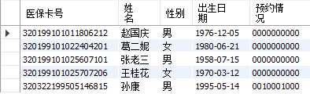

# 医疗预定系统

## 概述

医院预约挂号系统是指医院利用固定电话，网站，手机，短信等渠道方便患者预约看病所用系统。医院提供预约挂号系统对于方便群众就医、提高医疗服务水平具有重大意义。

根据实际体验江苏省中医药门诊预约系统，可将预约流程总结为下图1.1。

图1.1 医疗预定流程

本次医疗预定系统的设计的开发环境如下：

1. 编程软件：Visual Studio 2019；

2. 数据库管理系统软件：MySQL 8.0；

3. 界面设计软件：Qt 5.12；

开发语言：C++。

## 需求分析

根据江苏省中医院预约挂号的实际体验等，医疗预定系统主要包括三部分主体功能：患者登录、医生信息查询、预约时段选择。根据实际体验可将该系统的数据库管理部分划分为三个实体：患者、科室、医生，各实体所需包含的具体信息如图2.1所示。患者信息一般需要包含姓名、性别、年龄等；科室信息一般需要包含各大类科属和分支科属；医生（专家）信息一般需要包含姓名、性别、年龄、职称、简介及坐诊时间等。

           

图2.1 系统实体划分

由实体划分可绘制该系统的E-R图，如图2.2所示。其中科属的主键为科室编号，其余属性可选科室名称、常见疾病等；医生的主键为医生工号，与科室是所属关系，以科室编号作为外键，属性可选姓名、性别、职称、职务、坐诊时间等；患者的主键为医保卡号，与医生是诊疗关系，可选属性为姓名、性别、年龄等。

图2.2 系统E-R图

## 数据库设计

由E-R图可设计系统的数据库管理模型。在MySQL Workbench中建立register数据库框架，内设三个表，分别为department（科室）、doctor（医生）、patient（患者）。

department（科室）表的设计如图3.1所示。主键为id号，属性包括name（部门名称）、class（大类科属）、disease（常见疾病）。表中包括内科科室和外科科室各4个。

图3.1 department表设计

doctor（医生）表的设计如图3.2所示。主键为id号，外键为科室id号，属性包括name（姓名）、sex（性别）、birth（出生日期）、title（职称）、picture（肖像照）、time（坐诊时间）、info（预约信息）、brief（简介）。每个科室包含2各医生。

图3.2 doctor表设计

patient（患者）表的设计如图3.2所示。主键为ssn（医保卡号），属性包括name（姓名）、sex（性别）、birth（出生日期）、time（预约信息）。

图3.3 patient表设计

建立数据库表后为方便信息显示设计了3个视图，分别为 basic_inf（医生基本信息）、detail_inf（医生详细信息）、patient_inf（患者基本信息）视图，如图3.4所示。

图3.4 视图设计

## 界面设计

系统启动前将检查数据库是否连接成功，连接成功后启动医疗预定系统。界面分为患者登录区、时间日期显示区、科室选择区、医生列表区、所选医生信息查看区以及预约时间段选择区，如图4.1所示。

图4.1 医疗预定系统界面

输入患者姓名登录后可进行挂号预约，点击某科室后医生列表区将仅显示当前部门医生，如图4.2所示。点击某医生后医生信息查看区将显示该医生详细信息，点击简介将显示该医生简介。

图4.2 科室选择

点击显示“可预约”时段框可预约该医生该时段，当前时段预约后该患者将不能重复预约同时段。若该医生该时段预约次数超过5次将显示“已约满”，无法继续预约，如图4.3所示。

图4.3 约满提示
